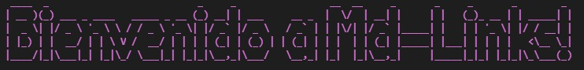
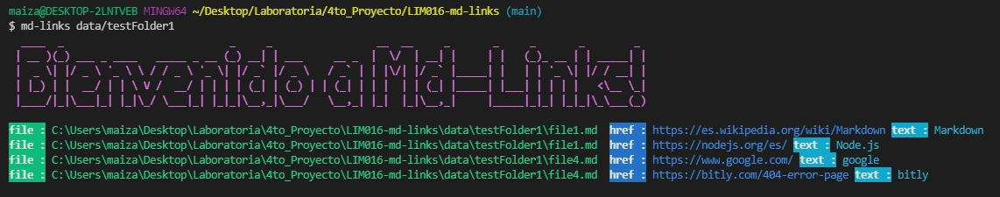
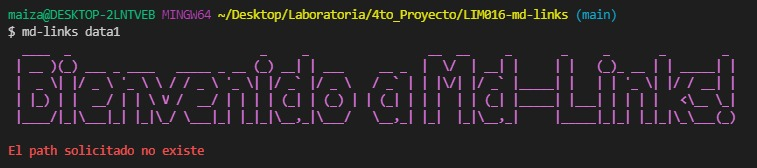
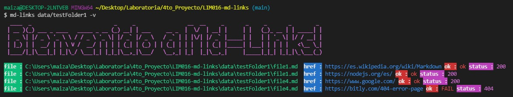
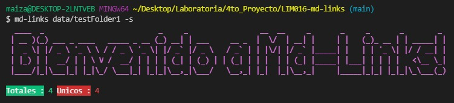
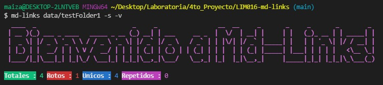
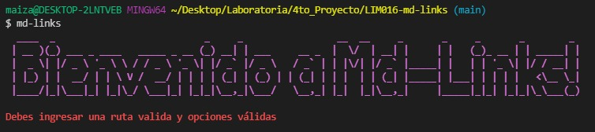

# MD-LINKS

## Índice

* [1. Introducción](#1-Introducción)
* [2. Instalación](#2-Instalación)
* [3. Guía de uso](#3-Guia_de_uso)
* [4. Planificación](#4-Planificación)
* [5. Keywords](#5-Keywords)
* [6. Autora](#6-Autora)

***


***
## 1. Introducción 👍



md-links es un librería que facilita la búsqueda y validación de links contenidos en archivos de formato ".md". Además también proporciona información relevante como: cantidad de links repetidos, únicos, rotos, estatus de la consulta http y mas.

***

## 2. Instalación 📋

Instalar la libreria por medio de la terminal :

```
npm install PandArtist93/LIM016-md-links
```

## 3. Guía de uso 🔧

Para que el usuario pueda ejecutar la librería debe ingresar la siguiente línea de comando a través de la consola.

```
md-links <path-to-file> [options]
```

Las rutas implementadas pueden ser absolutas o relativas. 

Entre las opciones que puede ingresar el usuario se encuentran: 

- --validate/ -validate/ -v / -V 

- --stats/ -stats/ -s / -S

- --stats --validate/ -stats -validate/ -s -v/ -S -V / (y las respectivas combinaciones).


## **Caso 1:** El usuario ingresa un path sin optiones.

## Caso 1.1 📌
El usuario ingresa un path válido.

```
md-links <path(valido)> 

```

)

## Caso 1.2 📌
El usuario ingresa un path inválido.

```
md-links <path(invalido)> 

```



## **Caso 2:** El usuario ingresa path y optiones.

## Caso 2.1 📌
El usuario ingresa un path válido y opcion inválida.

```
md-links <path(valido)> [option (invalido)]

```
Retorna mensaje de Error

)

## Caso 2.2 📌
El usuario ingresa un path y opcion válidas.

```
md-links <path(valido)> [option (valido)]

```
## Caso 2.2.1 - validate 📌
```
md-links <path> -v

```
Retorna todos los URL encotrados junto con su respectiva ruta, demas del mensaje y status de consulta http. 


## Caso 2.2.2 - stats 📌

```
md-links <path> -s

```
Retorna la cantidad de links totales y únicos.


## Caso 2.2.3 - stats -validate / -validate -stats 📌
```
md-links <path> -s -v

```
Retorna la cantidad de links totales, rotos, únicos y repetidos.


## **Caso 3:** El usuario no ingresa path ni optiones. 📌

```
md-links 

```
Retorna mensaje de Error

)

***

## 4. Planificación 📅

El siguiente proyecto tuvo una duración de 4 semanas, durante el cual se implementaron las siguientes herramientas para la planificación y división de tareas. 

<details><summary>Herramientas de planificación</summary><p>

  * [Trello]()
  * [Github Projects]()
</p></details>


### Este proyecto constó de DOS partes:

* API
  <details><summary>Flujo del API</summary><p>

    * [Diagrama-API]()
  </p></details>
* CLI
  <details><summary>Flujo del CLI</summary><p>

    * [Diagrama-CLI]()
  </p></details>

<details><summary>Flujo completo del proyecto</summary><p>

  * [Diagrama](https://miro.com/app/board/uXjVOWEsytk=/)
</p></details>  

***

## 5. Keywords 🔑

* javascript
* Mardown
* node
* npm
* jest
* CLI

***

## 6. Autora ✒️

😊 **Marielena Aizaga** - [PandArtist93](https://github.com/PandArtist93)

***

## 7. Repositorio original con las condiciones del proyecto🔗

 **Laboratoria** - [Laboratoria/LIM016-md-links](https://github.com/Laboratoria/LIM016-md-links) 💛